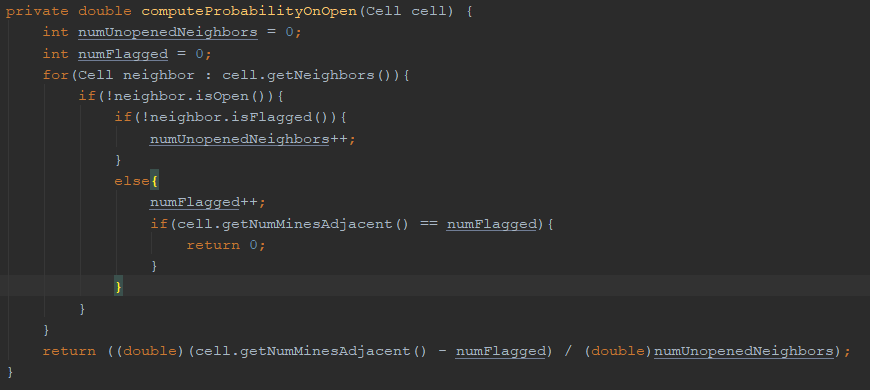
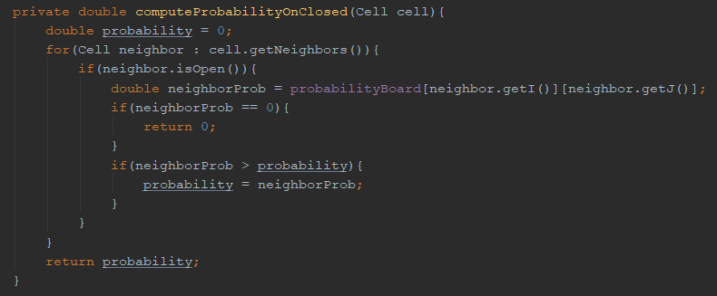
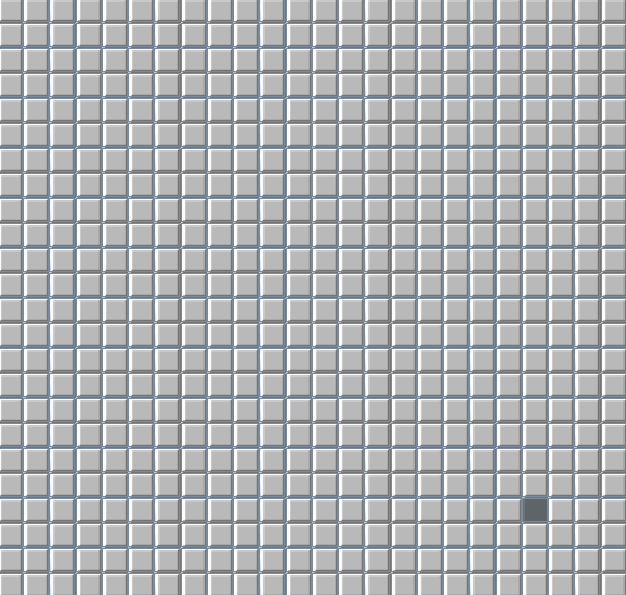
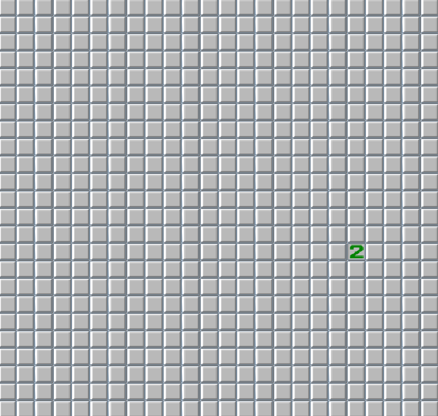
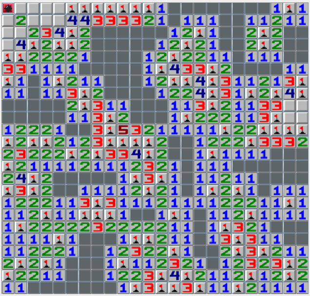

# Minesweeper AI

This is a playable minesweeper application in Java. The primary purpose of this project was to try and design an AI that could always win Minesweeper at any difficulty.

## Implementation

The algorithm behind this AI works by computing the probability that a mine exists on any "candidate" cell. A "candidate" cell is a cell that has neighbors which are open or flagged, as for any cell not meeting these conditions it is impossible to deduce the probability that a mine exists there. 

The algorithm first goes over every open, nonzero cell and computes the probability for any neighboring, candidate cell that a mine exists there. This is very simply the numerical value within the cell (the number of neighboring cells containing mines) divided by the number of neighboring, candidate cells.

The next step is to look at all candidate cells and find which of its open neighbors assigns the highest probability of mine existence to its neighboring cells.

Having now computed the probability that any candidate cell has a mine, the algorithm then flags all cells that have probability of 1, repeats the two above steps to account for the flagging, and then selects the candidate cell that has the lowest probability of containing a mine, typically 0. 

## Results
(gifs slowed for viewability)

A successful play on expert difficulty (24x24 with 99 mines) 

An unsuccessful play

The results are very good, and although it cannot be guaranteed, it appears that the AI performs perfectly when not faced with a guessing situation. Minesweeper inherently produces cases where there is no cell with a logical probability of a mine existing on it of 0. 

Below is a good example of a situation in which the AI is forced to guess.

## Review and Next Steps
In terms of algorithmic performance, this could certainly be better. Most calculations rely on nested for loop iterations across the 2D array of cells. A possible optimization would be to store open, nonzero cells and candidate cells in their own arrays and iterate across those arrays to compute probabilities, reducing time complexity of those methods from O(N^2) to O(N). The probability calculations also rely on each cell storing an array of its neighbors, over which it iterates. It may be advantageous to skip the use of a 2D array to store board values and to instead traverse the tree of neighboring cells, but I have not deeply considered this option due to its likely unnecessary complexity. 

For future changes I would like to improve the GUI significantly to allow for resetting the game board, enabling or disabling the AI, and even using the AI during a human player's game to recommend moves. The GUI is also fairly slow, and does not keep up with the AI moves and even the game's own propagation of opening zero valued cells. This was, however, a project of AI and not of effective GUI implementation. Some refactoring may also be in order to improve the readability of the algorithm.
